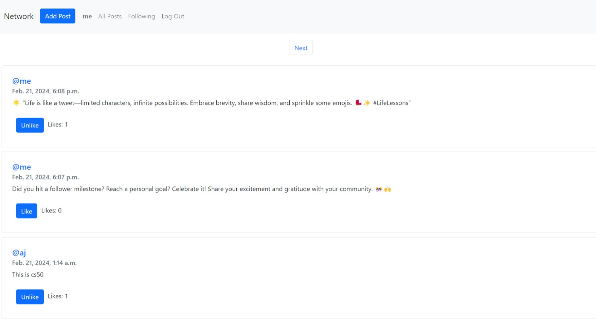
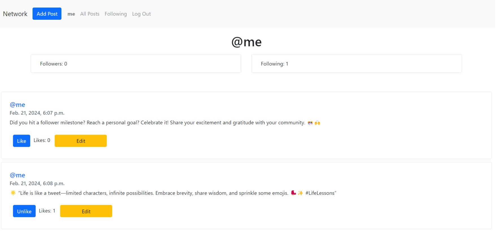

# Netwok 
## A django based social media website

This is a <a href="https://github.com/cs50"> @CS50</a> project  which uses django to build a social media website inspired from popular platforms like x.com. 

this project is made with the help of web development frameworks like django. it uses sqlite to handle its database
the project also consist of a dockerfile for easy maintenance of the project 

The features Include
    1. User registration and verification
    2. addition and editing of new posts
    3. a following page and a profile page to categorise the posts
    4. a feature that helps to follow and like pages and posts as in a regular social media
    

